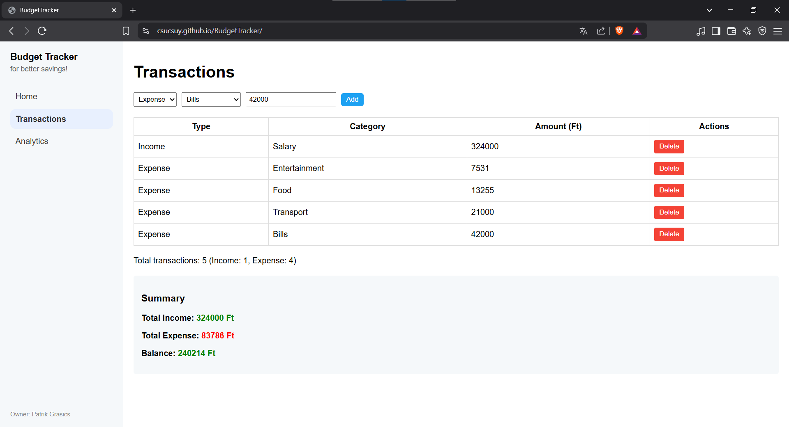
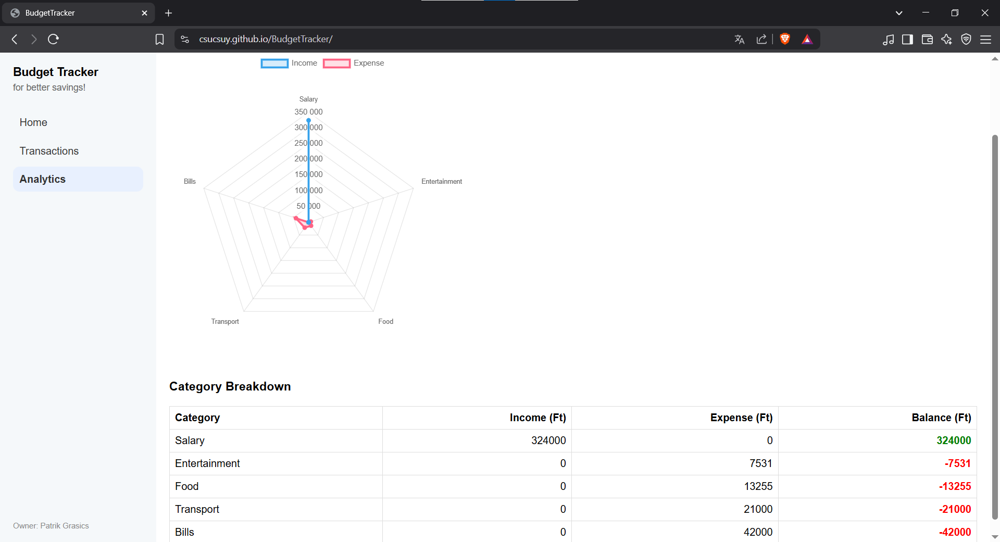

# Personal Budget Tracker

The **Personal Budget Tracker** is a simple, browser-based Single-Page Application (SPA) developed in F# using the WebSharper framework. The application aims to help users track their daily expenses by allowing them to add, list, and summarize expenses. The project is hosted on GitHub Pages, with automatic deployment via GitHub Actions on every push.

## Features

- **Add Expenses**: Users can input the amount, category (e.g., "Food", "Entertainment"), and date of an expense.
- **List Expenses**: Added expenses are displayed in chronological order.
- **Summary**: The application calculates and displays the total expenses in real-time.
- **Responsive UI**: A simple, browser-friendly interface that is easy to use.

## Technology Stack

- **Language**: F# (functional programming)
- **Framework**: WebSharper 8.x (for client-side SPA development)
- **UI**: WebSharper.UI (reactive components using Var and View)
- **Build Tool**: .NET 9.0 SDK
- **Hosting**: GitHub Pages
- **CI/CD**: GitHub Actions (automatic build and deploy)

## Future Enhancements

- **Local Storage**: Implement localStorage for persistent expense storage.
- **Category Filter**: Allow users to filter expenses by category.
- **Date Range Filter**: Enable filtering of expenses by date range.
- **User Authentication**: Implement user accounts for personalized expense tracking.
- **Mobile App**: Create a mobile version of the application for on-the-go expense tracking.
- **Export/Import**: Allow users to export and import their expense data.
- **Multi-Currency Support**: Enable users to track expenses in different currencies.
- **Recurring Expenses**: Implement a feature for recurring expenses (e.g., monthly subscriptions).
- **Notifications**: Send reminders for upcoming bills or budget limits.

## Getting Started

To run the Personal Budget Tracker locally, follow these steps:
Open the link and start using the app.
https://csucsuy.github.io/BudgetTracker/

## Quick guide

# Transaction view

